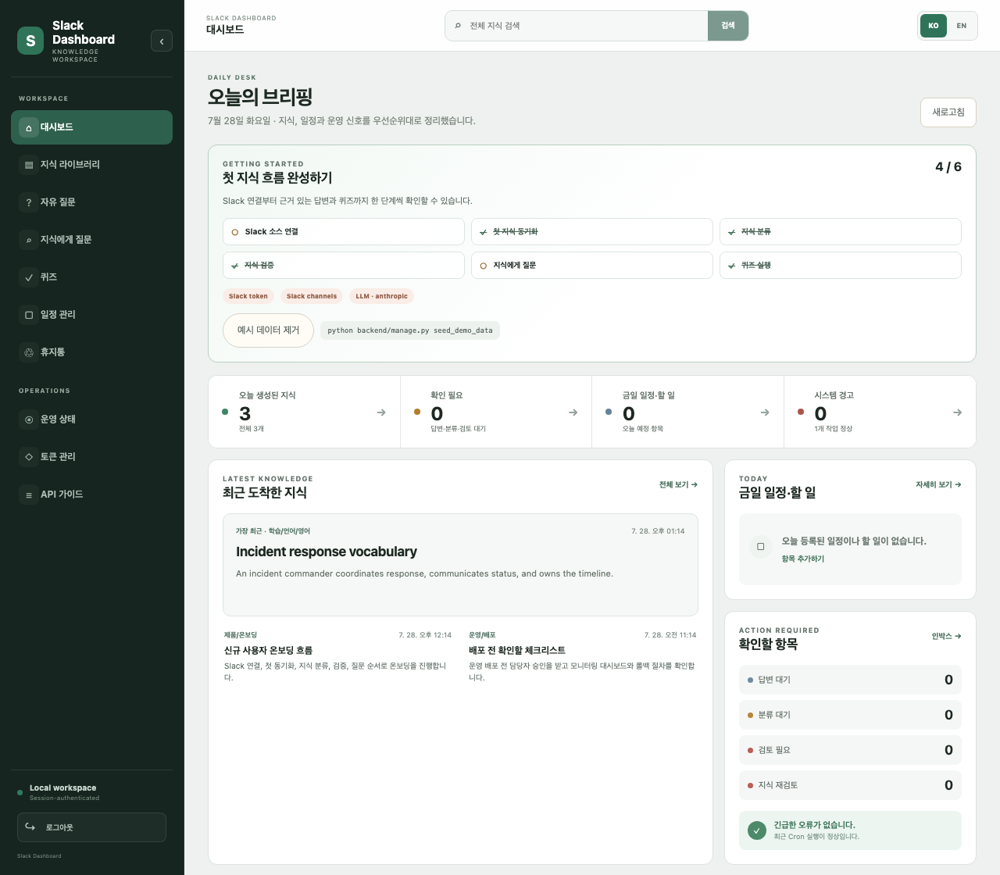
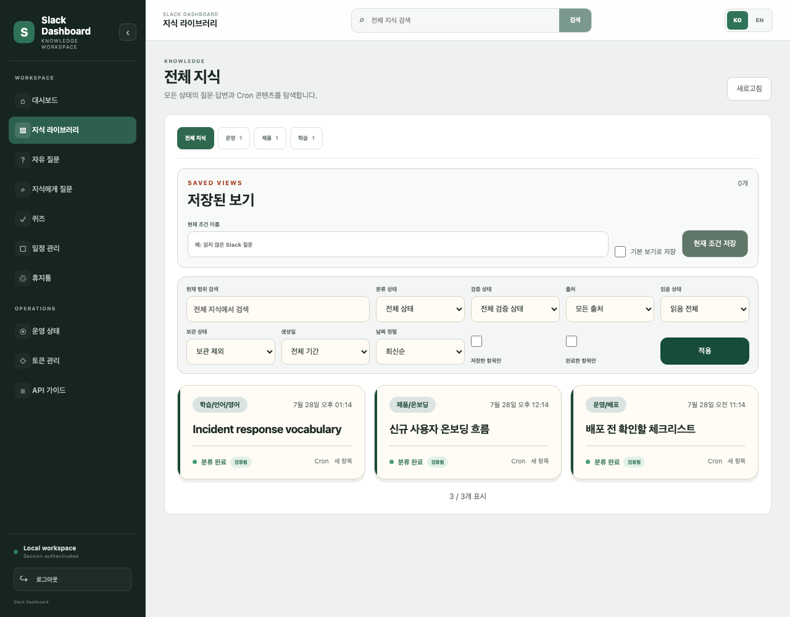
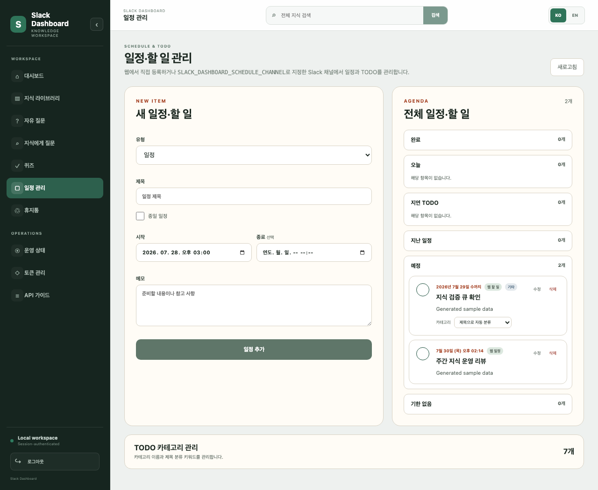

# Slack Knowledge Dashboard

Turn useful Slack conversations into a private knowledge operations workspace — search and verify what your team knows, ask cited questions, generate quizzes, and manage schedules and TODOs.

Built with Django (backend/API) and Nuxt (frontend SPA).



[Quickstart](#quickstart) · [Features](#features) · [Product tour](#product-tour) · [API guide](docs/API_GUIDE.md) · [MCP tools](docs/MCP_TOOLS.md)

> Screenshots use generated sample data from `seed_demo_data`. No real Slack workspace content is included.

## Features

- **Incremental Slack ingestion** — imports only messages newer than the saved per-channel checkpoint. A periodic `--full-rescan` also detects source deletions. The optional free-question view imports question threads and existing bot replies; it does not post answers to Slack. A schedule channel parses `2026-07-20 14:00~15:00 | title | notes` style messages into a calendar.
- **LLM classification** — an Anthropic or OpenAI model classifies each imported item into a category tree it builds up over time, with confidence thresholds and a manual-review fallback.
- **Cited Ask and knowledge trust** — ask the classified corpus a question, see the exact supporting knowledge items, mark answers helpful/unhelpful, and track verified, unverified, stale, and review-due knowledge.
- **Knowledge library** — browse, search, tag, bookmark, archive, filter by verification state, and give quality feedback on imported knowledge.
- **Configurable quiz generation** — generates multiple-choice/multi-select questions for enabled quiz-domain mappings, with spaced-repetition review. English, Japanese, and AWS SAA mappings are seeded as examples and can be changed in Django admin.
- **Schedule / TODO** — a calendar view backed by both the web UI and a Slack channel, with keyword-based auto-categorization.
- **Operator controls** — guided demo onboarding, LLM usage guardrails, data-retention and backup commands, source disconnect/purge controls, and an opt-in Slack operational digest.
- **Platform API** (`/api/v1/*`) — a scoped, Bearer-token-authenticated API plus an MCP server (`integrations/dashboard_platform_mcp.py`) so other agents/tools can read the knowledge base and create tasks/artifacts/approvals. See [docs/API_GUIDE.md](docs/API_GUIDE.md) and [docs/MCP_TOOLS.md](docs/MCP_TOOLS.md).

## Product tour

### Find, verify, and reuse Slack knowledge

Browse imported knowledge by category, source, status, verification state, and saved view. Verified source records can then support cited answers in the Ask workspace.



### Turn Slack messages into an agenda

Create schedules and TODOs in the web UI or sync them from a dedicated Slack channel, with overdue grouping and keyword-based TODO categories.



## Architecture

```
Slack workspace
     │  (Bot token, conversations.history/replies)
     ▼
sync_slack management command
     │
     ▼
Django + SQLite (or MySQL)  ──▶  classify_knowledge / tag_knowledge / generate_quiz_questions
     │                                  │  (Anthropic or OpenAI API)
     ▼                                  ▼
/api/*  (session auth, legacy)     Category tree, tags, quiz questions
/api/v1/*  (Bearer token + scopes) ──▶ integrations/dashboard_platform_mcp.py (MCP server)
     │
     ▼
Nuxt SPA  (served by WhiteNoise once built)
```

Everything runs as one Django process (`gunicorn` in production, `runserver` in dev) with a Nuxt-built static SPA served alongside it. There's no required external service beyond Slack and your LLM provider — MySQL is optional (SQLite is the default).

## Quickstart

Requirements: Python ≥3.12, Node ≥22.11.

```bash
git clone https://github.com/achieve0410/slack-dashboard.git
cd slack-dashboard

python3 -m venv venv
source venv/bin/activate
python -m pip install -r requirements-lock.txt

cd frontend && npm ci && cd ..

cp .env.example .env
# edit .env: at minimum set SLACK_BOT_TOKEN, SLACK_KNOWLEDGE_CHANNELS, and an LLM API key

python backend/manage.py migrate
python backend/manage.py createsuperuser

# two terminals:
./backend/deploy/dev-backend.sh    # Django on http://127.0.0.1:8000
./backend/deploy/dev-frontend.sh   # Nuxt dev server on http://localhost:3000, proxying /api to the backend
```

Open `http://localhost:3000`, log in with the superuser you created, and you'll see an empty dashboard. Run a sync to pull in Slack content:

```bash
python backend/manage.py sync_slack
```

Or load a clearly marked, removable sample workspace before connecting Slack:

```bash
python backend/manage.py seed_demo_data
python backend/manage.py seed_demo_data --purge
```

Use `requirements-mysql.txt` in addition to the core lock file only when running MySQL. Source dependency ranges live in `requirements.txt`; normal installations should use the reproducible lock file.

### Slack app setup

Create a Slack app at [api.slack.com/apps](https://api.slack.com/apps) (or use an existing one) and add these **Bot Token Scopes**:

| Scope | Why |
|---|---|
| `channels:history` | read public channels you configure as knowledge sources |
| `groups:history` | only needed if any source channel is private |
| `channels:read` | recommended — lets the dashboard show real channel names instead of raw IDs |

Install the app to your workspace, copy the `xoxb-...` Bot User OAuth Token into `SLACK_BOT_TOKEN`, and **invite the bot to every channel** you list in `SLACK_KNOWLEDGE_CHANNELS` (and the free-question/schedule channels, if used). To get a channel's ID, right-click it in Slack → View channel details → copy the ID at the bottom.

### LLM setup

Classification, tagging, quiz generation, and cited Ask all go through `backend/dashboard/llm.py`, a small adapter over the Anthropic and OpenAI SDKs (no other provider is wired up). Set in `.env`:

```
LLM_PROVIDER=anthropic          # or "openai"
LLM_MODEL=                      # required for openai; anthropic defaults to claude-sonnet-5
ANTHROPIC_API_KEY=...
# OPENAI_API_KEY=...
```

Recommended Anthropic models: `claude-opus-5` (highest quality), `claude-sonnet-5` (default, good balance), `claude-haiku-4-5` (cheapest, fine for classification).

Optional daily call, token, and estimated-cost limits are available through `LLM_DAILY_API_CALL_LIMIT`, `LLM_DAILY_TOKEN_LIMIT`, and `LLM_DAILY_COST_USD_LIMIT`. A value of `0` disables that individual limit. Set the per-million-token cost variables in `.env.example` if you want useful cost estimates in the operations screen.

### Running the pipelines

These are plain management commands — run them manually, or on a schedule (cron, systemd timer, launchd, whatever you already use):

```bash
python backend/manage.py sync_slack                 # pull new Slack content
python backend/manage.py classify_knowledge --limit 50   # classify pending items
python backend/manage.py tag_knowledge --publish     # regenerate the tag snapshot
python backend/manage.py generate_quiz_questions --publish  # generate quiz questions
```

`sync_slack` uses saved per-channel cursors by default. Run `sync_slack --full-rescan` periodically to reconcile messages deleted at the Slack source; this hides deleted source records locally without performing irreversible deletion. `--oldest <Slack timestamp>` is available for an explicit lower bound.

Quiz domains are rows in **Django admin → Quiz domain configs**. Each enabled row maps a slug to a classification category path, allowed question types, and optional allowlist requirement. The generator and UI read this configuration dynamically.

`backend/deploy/run-sync.sh`, `run-classify.sh`, `run-tagging.sh`, and `run-quiz.sh` wrap these with a shared file lock (so overlapping runs don't collide) — point your scheduler at those instead of calling `manage.py` directly. Example crontab:

```
*/15 * * * * /path/to/slack-dashboard/backend/deploy/run-sync.sh >> /path/to/slack-dashboard/backend/run/sync.log 2>&1
30 2 * * *   /path/to/slack-dashboard/backend/deploy/run-tagging.sh >> /path/to/slack-dashboard/backend/run/tagging.log 2>&1
30 3 * * *   /path/to/slack-dashboard/backend/deploy/run-classify.sh --limit 50 >> /path/to/slack-dashboard/backend/run/classify.log 2>&1
```

### Optional operations and data lifecycle

The following commands are deliberately opt-in. Destructive variants require an explicit confirmation flag:

```bash
# Preview or send the operational digest (never answers questions automatically)
python backend/manage.py send_slack_digest --dry-run
python backend/manage.py send_slack_digest --only-if-actionable

# Stop future sync while retaining imported data
python backend/manage.py disconnect_slack_source --channel-id C0123456789
# Permanently remove that source and its derived knowledge/quiz data
python backend/manage.py disconnect_slack_source --channel-id C0123456789 --purge --confirm

# Hide expired Slack-derived data, or explicitly hard-delete it
python backend/manage.py prune_dashboard_data --days 90
python backend/manage.py prune_dashboard_data --days 90 --hard-delete --confirm

# Write a Django JSON fixture under DASHBOARD_BACKUP_DIR (db/backups by default)
python backend/manage.py backup_dashboard
```

The project provides the commands, not a built-in scheduler. Add only the operations you want to cron/systemd/launchd after reviewing their output with `--dry-run` or the non-destructive default where available.

### Optional MCP server

Install the MCP dependency lock in the same virtual environment:

```bash
python -m pip install -r requirements-mcp-lock.txt
```

The MCP server runs over local stdio and calls the Platform API. Plain HTTP is accepted only for `localhost`, `127.0.0.1`, and `::1`; use HTTPS for every non-loopback address. See [docs/MCP_TOOLS.md](docs/MCP_TOOLS.md) for token issuance, registration, tools, and troubleshooting.

## Production notes

1. Build the frontend once and let Django/WhiteNoise serve it:
   ```bash
   cd frontend && npm run build && cd ..
   python backend/manage.py collectstatic --noinput
   ```
2. Set `DJANGO_DEBUG=0`, a real `DJANGO_SECRET_KEY` (the app refuses to start without one when debug is off), and `DJANGO_ALLOWED_HOSTS`/`DJANGO_CSRF_TRUSTED_ORIGINS` for your domain.
3. Run `python -m gunicorn --config backend/deploy/gunicorn.conf.py config.wsgi:application` (or `backend/deploy/run-gunicorn.sh`), bound to `127.0.0.1:8000` by default (override with `GUNICORN_BIND`).
4. Put a reverse proxy in front of it for TLS. `backend/deploy/nginx.conf.example` is a minimal starting point if you use nginx — any reverse proxy works.
5. For MySQL instead of SQLite: `python -m pip install -r requirements-mysql.txt`, `db/script.sh start` (spins up MySQL via Docker Compose, generates credentials into `db/slack_dashboard_db/.env`), then set `DJANGO_DB_ENGINE=mysql` plus the `DJANGO_DB_*` variables in `.env`.

## Security posture

- The legacy `/api/*` surface is gated by Django session auth (or an optional shared-secret Bearer token via `DASHBOARD_INTERNAL_API_TOKEN`) once `DASHBOARD_AUTH_REQUIRED=1`; the SPA itself always requires a logged-in session.
- The `/api/v1/*` Platform API uses per-agent Bearer tokens with explicit scopes (`platform:read`, `inbox:write`, `tasks:write`, `artifacts:write`, `approvals:request`, `approvals:decide`) — see [docs/API_GUIDE.md](docs/API_GUIDE.md).
- This is a single-operator tool: there's no multi-tenant user model. Don't expose it to untrusted users.
- Daily LLM call/token/cost guardrails are optional and disabled when their values are `0`. There is no per-user request rate limiter; keep the single-operator surface behind authentication and set non-zero budgets if cost containment matters.

## Privacy and data handling

Slack content is stored by the self-hosted instance. Classification, tagging, quiz generation, and cited Ask send the content needed for those operations to the configured Anthropic or OpenAI API. The opt-in Slack digest posts operational counts and up to three pending-question titles to its configured channel. The project does not include analytics or telemetry. Operators remain responsible for workspace authorization, notices, retention, deletion, backups, and provider terms. Read [PRIVACY.md](PRIVACY.md) before importing real workspace content.

## Limitations

- Korean and English are available for the global navigation and cited Ask flow. Several established detail/operations screens still contain Korean copy; localization is a foundation rather than complete translation coverage.
- Quiz domains are configurable, but a knowledge item must still be classified under an enabled domain's exact category path before it can produce questions.
- Incremental sync cannot detect source-side deletion until `--full-rescan` runs. Reconciliation hides deleted source records; use the explicit retention/source purge commands when hard deletion is required.
- Single-operator design — no per-user data isolation.

## Contributing and support

Contributions are welcome. Read [CONTRIBUTING.md](CONTRIBUTING.md) and [CODE_OF_CONDUCT.md](CODE_OF_CONDUCT.md) before opening a pull request. Use the issue forms for bugs and feature requests, [SUPPORT.md](SUPPORT.md) for support expectations, and [SECURITY.md](SECURITY.md) for private vulnerability reporting.

## License

MIT — see [LICENSE](LICENSE).

Slack is a trademark of Slack Technologies, LLC. This independent project is not affiliated with, endorsed by, or sponsored by Slack Technologies, Anthropic, or OpenAI.
